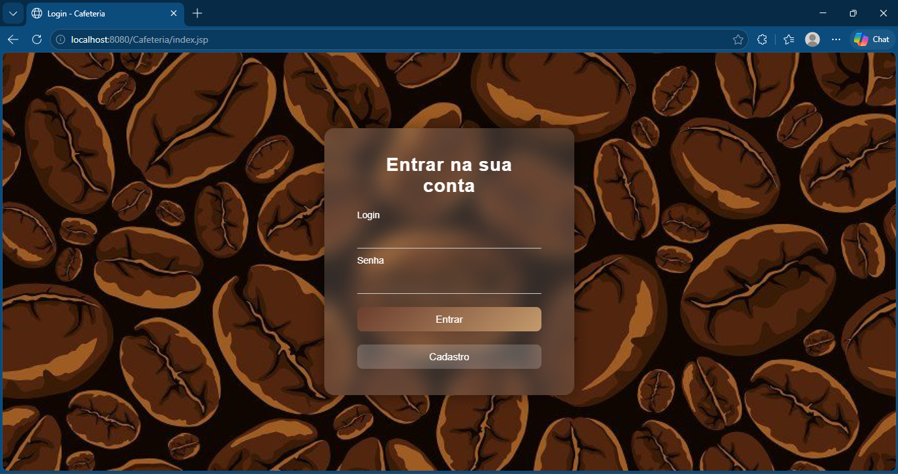
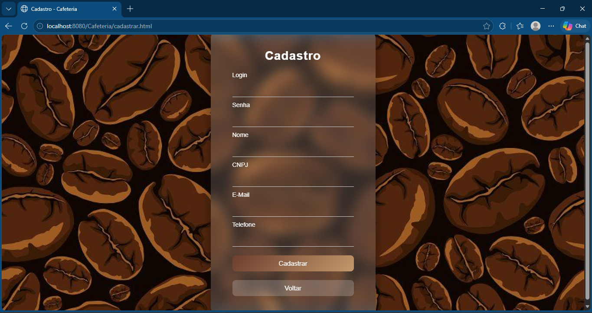
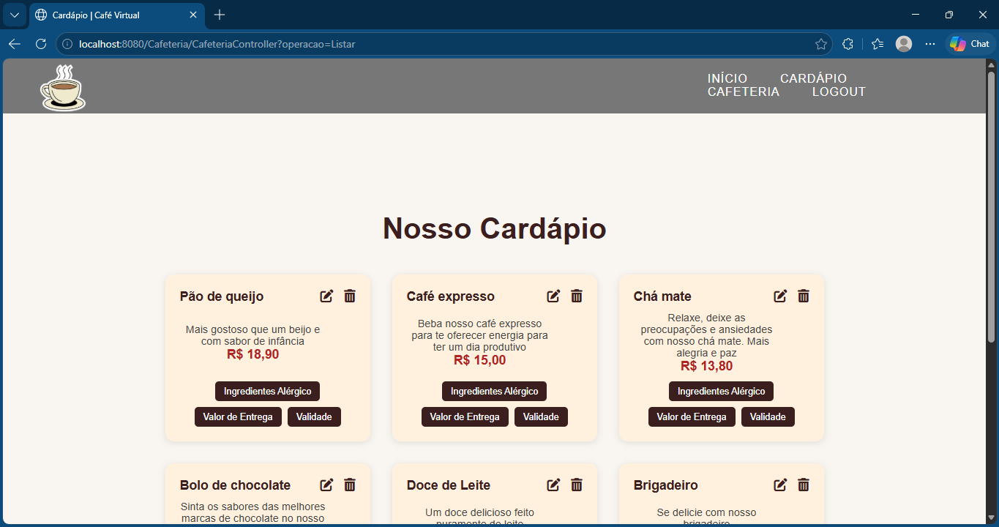
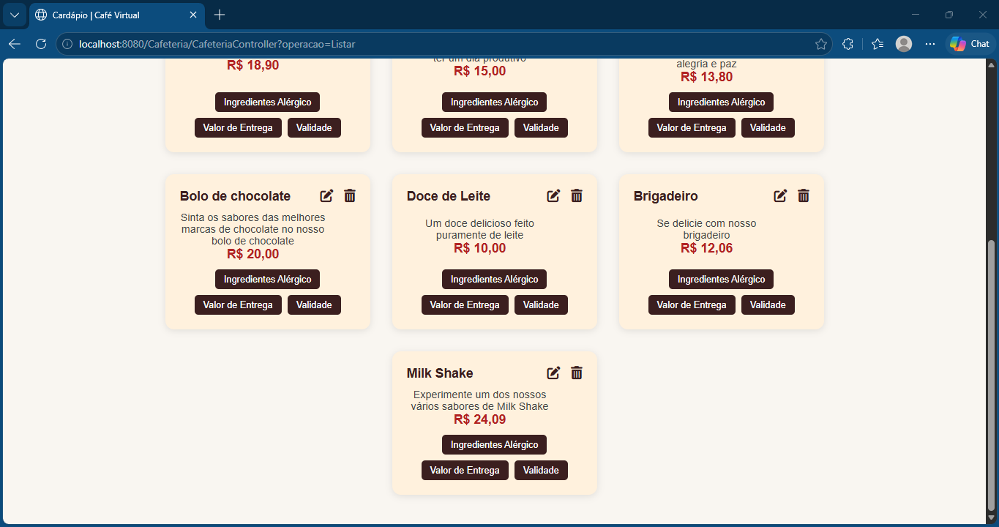
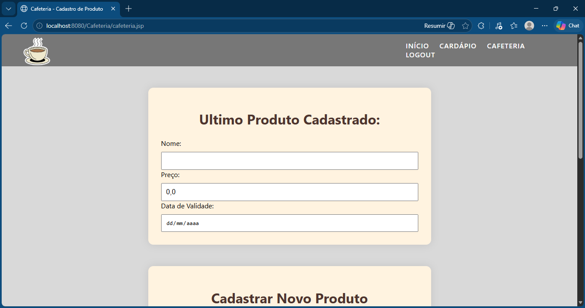
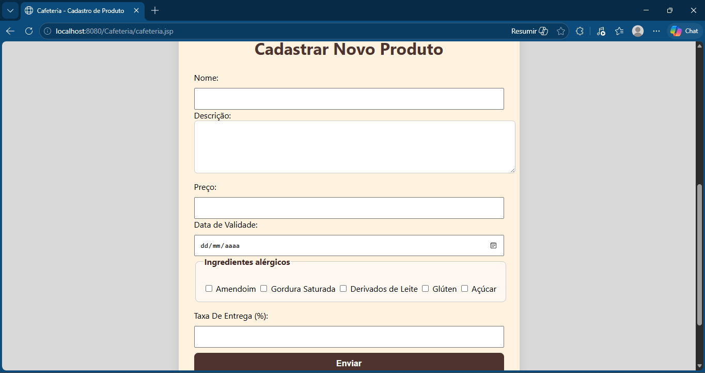
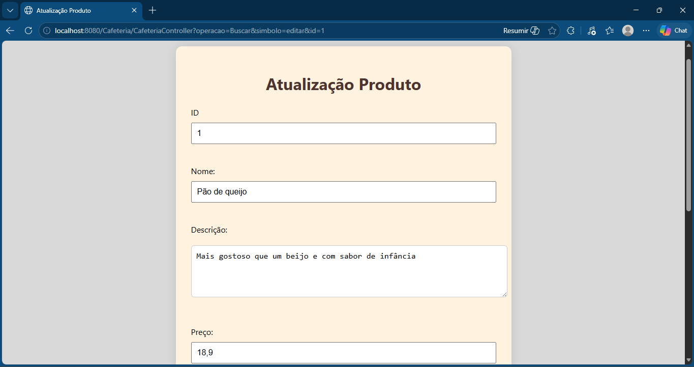
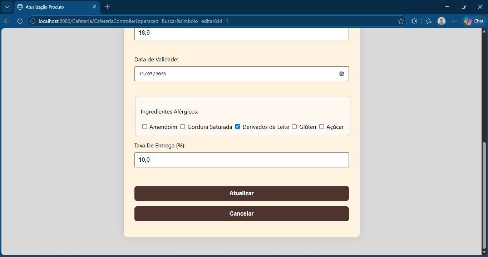

# ☕ Cafeteria System
Aplicação web desenvolvida para gerenciamento de cafeteria, permitindo autenticação de usuários, gerenciamento de produtos e exibição de cardápio.
O projeto foi desenvolvido utilizando Java, JSP, Servlets e MySQL, aplicando conceitos de arquitetura MVC, integração com banco de dados e operações CRUD.

---

# 📸 Demonstração

### 🎥 Demonstração da Aplicação


---

### 🔑 Tela de Login



---

### 📝 Cadastro de Usuário



---

### 🍽️ Cardápio — Parte 1



---

### 🍽️ Cardápio — Parte 2



---

### ➕ Cadastro de Produto — Parte 1



---

### ➕ Cadastro de Produto — Parte 2



---

### ✏️ Edição de Produto — Parte 1



---

### ✏️ Edição de Produto — Parte 2



---

# 🎯 Objetivo
Desenvolver uma aplicação web para gerenciamento de produtos e usuários de uma cafeteria, com foco na prática de desenvolvimento back-end, organização de sistemas web e integração entre front-end e back-end.

---

# ⚙️ Funcionalidades
- Cadastro de usuários
- Autenticação e controle de sessão
- Cadastro de produtos
- Atualização e remoção de produtos
- Listagem de produtos do cardápio
- Exibição de ingredientes e validade
- Cálculo de taxa de entrega
- Armazenamento temporário de informações utilizando cookies

---

# 🛠️ Tecnologias Utilizadas
## Back-end
- Java 21
- Jakarta Servlet
- JSP
- JSTL
- JPA / Hibernate
## Front-end
- HTML
- CSS
- JavaScript
## Banco de Dados
- MySQL
## Ferramentas
- Maven
- Git
- GitHub
- Eclipe Java EE

---

# 🧠 Conceitos Aplicados
- Arquitetura MVC
- CRUD
- Programação Orientada a Objetos (POO)
- Integração com banco de dados
- Controle de sessão
- Manipulação de cookies
- Organização em camadas
- Persistência de dados com JPA/Hibernate

---

# 📂 Estrutura do Projeto
```plaintext
src/
 ├── main/
 │    ├── java/
 │    │     ├── controller/
 │    │     ├── model/
 │    │
 │    ├── resources/
 │    │     └── META-INF/
 │    │
 │    └── webapp/
 │          ├── css/
 │          ├── js/
 │          ├── images/
 │          └── WEB-INF/
```

---

# 🚀 Como Executar
## 1️⃣ Clone o repositório
```bash
git clone https://github.com/seu-usuario/cafeteria-system.git
```

---

## 2️⃣ Acesse a pasta do projeto
```bash
cd cafeteria-system
```

---

## 3️⃣ Configure o banco de dados
Edite o arquivo:
```plaintext
src/main/resources/META-INF/persistence.xml
```
Configure:
- URL do banco
- usuário
- senha

---

## 4️⃣ Execute o build
```bash
mvn clean package
```

---

## 5️⃣ Execute no servidor
Implante o arquivo `.war` gerado em um servidor compatível com Jakarta EE:
- Apache Tomcat
- WildFly

---

# 🗄️ Configuração do Banco de Dados
Exemplo de configuração utilizada:
```xml
<property name="jakarta.persistence.jdbc.url" value="jdbc:mysql://localhost:3306/cafeteria"/>
<property name="jakarta.persistence.jdbc.user" value="cafeteria"/>
<property name="jakarta.persistence.jdbc.password" value="cafe"/>
```

---

# 👨‍💻 Minha Contribuição
Projeto desenvolvido em grupo com 3 integrantes.
Minhas principais responsabilidades foram:
- Desenvolvimento completo do back-end
- Estruturação da arquitetura MVC
- Integração com banco de dados MySQL
- Implementação das regras de negócio
- Desenvolvimento de autenticação e CRUD
- Participação parcial no front-end utilizando JavaScript e JSTL

---

# 📈 Melhorias Futuras
- Implementação de API REST
- Ajustar o projeto para usar o Spring Boot
- Sistema de pedidos online
- Dashboard administrativo
- Melhorias de responsividade
- Integração com sistema de pagamento

---

# 👨‍💻 Autor
**Yuri Rodrigues Lombardi**

🔗 LinkedIn:  
https://linkedin.com/in/yuri-rodrigues-lombardi

💻 GitHub:  
https://github.com/yuriRLombardi
